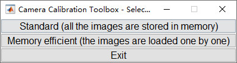
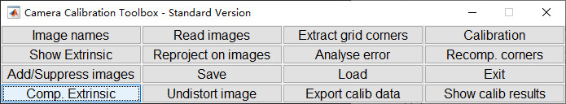

# 安装及注意事项

## 安装和说明文档
**获取途径**： 说明文档[Documentation](http://www.vision.caltech.edu/bouguetj/calib_doc/)以及下载地址[Download](http://www.vision.caltech.edu/bouguetj/calib_doc/download/index.html)。下载压缩包解压出来即可使用，建议解压到`Matlab`安装目录中的`toolbox`文件夹中，然后在`Matlab`的`设置路径`中添加整个`toolbox`到路径。

## 注意事项
1. 使用时输入`pwd`获取当前工作文件夹或者打开文件夹作为当前工作文件夹；
2. 在命令行输入`calib_gui`或`calib`来启动GML标定工具，正式开始使用前将需要标定的图片移动到工作文件夹内，*不能放在文件夹里面*
3. 用于标定的图片至少为10张比较好，使用大于等于A3纸张打印棋盘图片

# 标定

## 单目标定
1. 将图片放到当前工作目录之后，命令行输入`calib_gui`打开标定软件，选择标准模式`standard`，一般不会出现内存不够的情况；

2. 点击`imagename`查看当前目录中的图片，

导入时需要输入文件名前面不包含数字的部分，

此时matlab会弹出你选择的图片的组合界面，位置是根据输入图片的数字编号来决定的，并不会影响结果；

3. 单击`Extract grid corners`，

参数选择默认即可，

然后根据提示用鼠标将所有图片的棋盘的角点点出来，

选择完后，第一张会询问是否更改其他参数，默然即可，

然后会出来两张提取角点后的图片，

对所有图片进行同样的操作；
4. 单击`calibration`，

命令行会输出计算的相机的内参；

5. 单击`Comp. Extrinsic`，

此时会要求输入要计算外参的图片的全名(不包含扩展名)以及图片格式，

其他参数默认即可，

接下来按之前的方法框出四个角点，

选择完后会输出两张图片，

命令行会输出外参参数值，

至此获取相机内外参数步骤结束。

