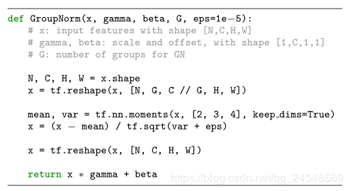

<!-- @import "[TOC]" {cmd="toc" depthFrom=1 depthTo=6 orderedList=false} -->

<!-- code_chunk_output -->

* [卷积神经网络（Convolution Neural Network,CNN）](#卷积神经网络convolution-neural-networkcnn)
	* [基础概念](#基础概念)
		* [卷积层](#卷积层)
			* [通道（channel）](#通道channel)
			* [填充（padding）](#填充padding)
			* [步长（stride）](#步长stride)
			* [卷积的计算](#卷积的计算)
		* [池化（pooling）](#池化pooling)
			* [最大池化（max pooling）](#最大池化max-pooling)
			* [平均池化（average pooling）](#平均池化average-pooling)
		* [全连接（Full connect,FC）](#全连接full-connectfc)
		* [SoftMax](#softmax)
			* [Softmax VS k个二元分类器](#softmax-vs-k个二元分类器)
			* [Softmax 与 SVM](#softmax-与-svm)
		* [激活函数（Activate Function）](#激活函数activate-function)
			* [激活函数的作用](#激活函数的作用)
			* [激活函数的选择](#激活函数的选择)
		* [标准化（normalization）](#标准化normalization)
			* [批标准化（batch normalization）](#批标准化batch-normalization)
				* [Synchronized Batch Normalization](#synchronized-batch-normalization)
				* [Group Normalization](#group-normalization)
		* [反卷积(转置卷积)](#反卷积转置卷积)
		* [孔洞卷积/膨胀卷积](#孔洞卷积膨胀卷积)
			* [孔洞卷积应用](#孔洞卷积应用)
			* [优缺点](#优缺点)
		* [感受野（Receptive field，RF）](#感受野receptive-fieldrf)
			* [感受野可视化](#感受野可视化)
			* [感受野的计算](#感受野的计算)
		* [局部连接与权值共享](#局部连接与权值共享)
			* [局部连接（Local Connectivity）](#局部连接local-connectivity)
			* [权值共享（parameter sharing）](#权值共享parameter-sharing)
	* [经典CNN模型](#经典cnn模型)
		* [总览](#总览)
	* [注意事项](#注意事项)

<!-- /code_chunk_output -->

# 卷积神经网络（Convolution Neural Network,CNN）

    性质：位移、尺度、缩放、非线性形变稳定性

卷积神经网络（CNN）是一类人工神经网络。因此，它们是由被称为「神经元」的单元构成的，这些单元可根据输入的加权和输出一个活动水平。这个活动水平通常是输入的非线性函数，通常只是一个整流线性单元（ReLU），其中当输入全为正时活动等于输入，当输入全为非正时活动等于 0。

CNN 的独特之处是神经元之间的连接的构建方式。在一个前馈神经网络中，单元会被组织成层的形式，给定层的单元只会获得来自其下面一层的输入（即不会有来自同一层或后续层的其它单元的输入，大多数情况下也不会有来自之前超过 1 层的输入）。CNN 是**前馈网络**。但不同于标准的单纯的前馈网络，CNN 中的单元具有一种空间排列。在每一层，单元都会被组织成 2D 网格形式，这被称为特征图（feature map）。每一个特征图都是在其下面一层上执行卷积所得的结果（CNN 也因此得名）。这意味着在其下面一层的每个位置都应用了同样的卷积过滤器（权重集）。因此，在该 2D 网格上特定位置的单元只能收到来自其下面一层相似位置的单元的输入。此外，输入上附带的权重对一个特征图中的每个单元都是一样的（而各个特征图各不相同）。

  

Convolution Neural Network

大多数现代 CNN 都有多个（至少 5）这样的层，其中最后一层会向一个全连接层馈送数据。全连接层就像是标准的前馈网络，其中没有空间布局或受限的连接。通常会有 2-3 个全连接层连在一起使用，并且网络的最后一层执行分类。举个例子，如果该网络执行的是 10 类目标分类，那么最后一层将会有 10 个单元，会有一个 softmax 操作应用在它们的活动水平上以得到每个类别相关的概率。

这些网络主要通过监督学习和反向传播训练。这时，提供给网络的输入是图像及其相关类别标签构成的配对集。图像像素值输入网络的第一层，然后网络最后一层得出一个预测类别。如果这个预测得到的标签与所提供的标签不一致，那么就会计算梯度，确定应该如何修改权重（即卷积过滤器中的值）以使分类正确。如此重复很多很多次（很多网络都是在 ImageNet 数据库上训练的，这个数据库包含 1000 个目标类别的超过 100 万张图像），就能得到在留存测试图像上有很高准确度的模型。CNN 的某些变体模型现在已能达到 4.94% 乃至更低的错误率，优于人类水平。要得到优良的表现，通常需要很多训练「技巧」，比如智能学习率选择和权重正则化（主要是通过 dropout，即在每个训练阶段都有随机一半的权重关闭）。

历史上曾使用无监督预训练来初始化权重，然后再使用监督学习来进行改善。但是，这似乎已经不再是优越性能所必需的了。

*参考：* [卷积神经网络十五问](http://baijiahao.baidu.com/s?id=1602962974655940776&wfr=spider&for=pc)；[卷积神经网络超详细介绍](https://blog.csdn.net/jiaoyangwm/article/details/80011656#1_2)

## 基础概念

### 卷积层
这一层就是卷积神经网络最重要的一个层次，也是“卷积神经网络”的名字来源。在这个卷积层，有两个关键操作：
- 局部关联。每个神经元看做一个滤波器(filter)
- 窗口(receptive field)滑动， filter对局部数据计算
  
卷积层超参数有：
- 通道（channel）
- 填充（padding）：P
- 步长（stride）： S

参考：[卷积神经网络CNN总结](https://www.cnblogs.com/skyfsm/p/6790245.html)

#### 通道（channel）
通道也叫做深度（depth），输入与输出都有自己的通道数目，输入通道的数目决定每个filter里面有多少个卷积核，输出通道的数目由超参数$out channel$决定，也就是有多少个神经元/filter，经过一次卷积之后，便会得到相应通道数的卷积输出

#### 填充（padding）

使用filter来做元素乘法运算来完成卷积运算的。目的是为了完成探测垂直边缘这种特征。但这样做会带来两个问题。

- 卷积运算后，输出图片尺寸缩小
- 越是边缘的像素点，对于输出的影响越小，因为卷积运算在移动的时候到边缘就结束了。中间的像素点有可能会参与多次计算，但是边缘像素点可能只参与一次。所以我们的结果可能会丢失边缘信息。

为了解决这个问题，引入padding，在图片外围补充一些像素点，把这些像素点初始化为0：

#### 步长（stride）
Stride表示filter在原图片中水平方向和垂直方向每次的步进长度。若stride=2，则表示filter每次步进长度为2，即隔一点移动一次。

####卷积的计算
一个$padding=1,stride=2,kernel size=3x3, filter number=2$的卷积操作如下所示

蓝色的矩阵(输入图像)对粉色的矩阵（filter）进行矩阵内积计算并将三个内积运算的结果与偏置值b相加（比如下图的计算：2+（-2+1-2）+（1-2-2） + 1= 2 - 3 - 3 + 1 = -3），计算后的值就是绿框矩阵的一个元素。

### 池化（pooling）

池化的作用：
- 减少参数。通过对 Feature Map 降维，使特征图变小，有效减少后续层需要的参数，简化网络计算复杂度，并通过减小网络参数和计算量来抑制过拟合
- Translation Invariance。它表示对于 Input，当其中像素在邻域发生微小位移时，Pooling Layer 的输出是不变的。这就使网络的鲁棒性增强了，有一定抗扰动的作用
- 进行特征压缩，提取主要特征，即特征降维，我们知道一幅图像含有的信息是很大的，特征也很多，但是有些信息对于我们做图像任务时没有太多用途或者有重复，我们可以把这类冗余信息去除，把最重要的特征抽取出来，这也是池化操作的一大作用。
- 特征不变性，也就是我们在图像处理中经常提到的特征的尺度不变性，池化操作就是图像的resize，平时一张狗的图像被缩小了一倍我们还能认出这是一张狗的照片，这说明这张图像中仍保留着狗最重要的特征，我们一看就能判断图像中画的是一只狗，图像压缩时去掉的信息只是一些无关紧要的信息，而留下的信息则是具有尺度不变性的特征，是最能表达图像的特征。

pooling操作是特征图缩小，有可能影响网络的准确度，因此可以通过增加特征图的深度来弥补（深度变为原来的2倍）。

根据相关理论，特征提取的误差主要来自两个方面：
- 邻域大小受限造成的估计值方差增大；
- 卷积层参数误差造成估计均值的偏移。

一般来说，
- mean-pooling能减小第一种误差（邻域大小受限造成的估计值方差增大），更多的保留图像的背景信息，
- max-pooling能减小第二种误差（卷积层参数误差造成估计均值的偏移），更多的保留纹理信息。
- Stochastic-pooling则介于两者之间，通过对像素点按照数值大小赋予概率，再按照概率进行亚采样，在平均意义上，与mean-pooling近似，在局部意义上，则服从max-pooling的准则。
#### 最大池化（max pooling）
即对一小块区域取最大值,假设pooling的窗大小是2x2,

1.forward:就是在前面卷积层的输出的不重叠地进行2x2的取最大值降采样，就得到max-pooling的值。

2.backward:在max-pooling前向传播时,只取最大值,其他值无作用。因此反向传播时，只关注最大值，所以将残差传递到该最大值的位置，区域内其他2x2-1=3个位置置零

#### 平均池化（average pooling）
假设pooling的窗大小是2x2, 在forward的时候啊，就是在前面卷积完的输出上依次不重合的取2x2的窗平均，得到一个值就是当前mean pooling之后的值，对一块小区域取平均值,假设pooling的窗大小是2x2,

1.forward:就是在前面卷积层的输出的不重叠地进行2x2的取平均值降采样，就得到mean-pooling的值。

2.backward:把一个值分成四等分放到前面2x2的格子区域里面就好了。

### 全连接（Full connect,FC）

两层之间所有神经元都有权重连接，通常全连接层在卷积神经网络尾部。也就是跟传统的神经网络神经元的连接方式是一样的：

作用：
- 将前面经过多次卷积后高度抽象化的特征进行整合，然后可以进行归一化，对各种分类情况都输出一个概率，之后的分类器(Classifier)可以根据全连接得到的概率进行分类。 

缺点：
- 参数过多，过多使用全连接层将导致计算复杂度大大增加
- 会破坏图像的空间结构

### SoftMax
在机器学习尤其是深度学习中，softmax是个非常常用而且比较重要的函数，尤其在多分类的场景中使用广泛。他把一些输入映射为0-1之间的实数，并且归一化保证和为1，因此多分类的概率之和也刚好为1。 
首先我们简单来看看softmax是什么意思。顾名思义，softmax由两个单词组成，其中一个是max。对于max我们都很熟悉，比如有两个变量a,b。如果a>b，则max为a，反之为b。用伪码简单描述一下就是 if a > b return a; else b。 
另外一个单词为soft。max存在的一个问题是什么呢？如果将max看成一个分类问题，就是非黑即白，最后的输出是一个确定的变量。更多的时候，我们希望输出的是取到某个分类的概率，或者说，我们希望分值大的那一项被经常取到，而分值较小的那一项也有一定的概率偶尔被取到，所以我们就应用到了soft的概念，即最后的输出是每个分类被取到的概率。

假设有一个数组V，Vi表示V中的第i个元素，那么这个元素的softmax值为: 
$$S_i = \frac{e^i}{\sum_j e^j}$$
该元素的softmax值，就是该元素的指数与所有元素指数和的比值，softmax设计的初衷，是希望特征对概率的影响是乘性的。 

#### Softmax VS k个二元分类器
如果你在开发一个音乐分类的应用，需要对k种类型的音乐进行识别，那么是选择使用 softmax 分类器呢，还是使用 logistic 回归算法建立 k 个独立的二元分类器呢？ 
这一选择取决于你的类别之间是否互斥，例如，如果你有四个类别的音乐，分别为：古典音乐、乡村音乐、摇滚乐和爵士乐，那么你可以假设每个训练样本只会被打上一个标签（即：一首歌只能属于这四种音乐类型的其中一种），此时你应该使用类别数 k = 4 的softmax回归。（如果在你的数据集中，有的歌曲不属于以上四类的其中任何一类，那么你可以添加一个“其他类”，并将类别数 k 设为5。） 
如果你的四个类别如下：人声音乐、舞曲、影视原声、流行歌曲，那么这些类别之间并不是互斥的。例如：一首歌曲可以来源于影视原声，同时也包含人声 。这种情况下，使用4个二分类的 logistic 回归分类器更为合适。这样，对于每个新的音乐作品 ，我们的算法可以分别判断它是否属于各个类别。

#### Softmax 与 SVM
Softmax线性分类器的损失函数计算相对概率，又称交叉熵损失「Cross Entropy Loss」。线性 SVM 分类器和 Softmax 线性分类器的主要区别在于损失函数不同。SVM 使用 hinge loss，更关注分类正确样本和错误样本之间的距离「Δ = 1」，只要距离大于 Δ，就不在乎到底距离相差多少，忽略细节。而 Softmax 中每个类别的得分函数都会影响其损失函数的大小。举个例子来说明，类别个数 C = 3，两个样本的得分函数分别为[10, -10, -10]，[10, 9, 9]，真实标签为第0类。对于 SVM 来说，这两个 Li 都为0；但对于Softmax来说，这两个 Li 分别为0.00和0.55，差别很大。

### 激活函数（Activate Function）
	增加模型的非线性表达能力

神经网络神经元中，输入的 inputs 通过加权，求和后，还被作用了一个函数，这个函数就是激活函数 Activation Function。

#### 激活函数的作用
神经网络中激活函数的主要作用是提供网络的非线性建模能力，如不特别说明，激活函数一般而言是非线性函数。假设一个示例神经网络中仅包含线性卷积和全连接运算，那么该网络仅能够表达线性映射，即便增加网络的深度也依旧还是线性映射，难以有效建模实际环境中非线性分布的数据。加入（非线性）激活函数之后，深度神经网络才具备了分层的非线性映射学习能力。

激活函数通常有如下一些性质：

- 非线性：如果不用激励函数，每一层输出都是上层输入的线性函数，无论神经网络有多少层，输出都是输入的线性组合。如果使用的话，激活函数给神经元引入了非线性因素，使得神经网络可以任意逼近任何非线性函数，这样神经网络就可以应用到众多的非线性模型中。当激活函数是非线性的时候，一个两层的神经网络就可以逼近基本上所有的函数了。但是，如果激活函数是恒等激活函数的时候（即），就不满足这个性质了，而且如果MLP使用的是恒等激活函数，那么其实整个网络跟单层神经网络是等价的。
- 可微性： 当优化方法是基于梯度的时候，这个性质是必须的。
- 单调性： 当激活函数是单调的时候，单层网络能够保证是凸函数。
- 随机小值初始化： 当激活函数满足这个性质的时候，如果参数的初始化是random的很小的值，那么神经网络的训练将会很高效；如果不满足这个性质，那么就需要很用心的去设置初始值。
- 输出值的范围： 当激活函数输出值是 有限 的时候，基于梯度的优化方法会更加 稳定，因为特征的表示受有限权值的影响更显著；当激活函数的输出是 无限 的时候，模型的训练会更加高效，不过在这种情况小，一般需要更小的learning rate。

#### 激活函数的选择
常用的激活函数：

- sigmoid:
  - 优点：
    - 在特征相差比较复杂或是相差不是特别大时效果比较好（这样饱不饱和就没那么在影响了?）。
	- sigmoid激活函数在除了前馈网络以外的情景中更为常见。循环网络、许多概率模型以及一些自编码器有一些额外的要求使得它们不能使用分段线性激活函数，并且使得sigmoid单元更具有吸引力，尽管它存在饱和性的问题。
  - 缺点：
    - 激活函数计算量大，反向传播求误差梯度时，求导涉及除法；
    - 与分段线性单元不同，sigmoid单元在其大部分定义域内都饱和——当z取绝对值很大的正值时，它们饱和到一个高值，当z取绝对值很大的负值时，它们饱和到一个低值，并且仅仅当z接近0时它们才对输入强烈敏感。sigmoid单元的广泛饱和性会使得基于梯度的学习变得非常困难。因为这个原因，现在不鼓励将它们用作前馈网络中的隐藏单元。当使用一个合适的代价函数来抵消sigmoid的饱和性时，它们作为输出单元可以与基于梯度的学习相兼容。
    - Sigmoid 的 output 不是0均值。
- ReLU:
  - 优点
    - 速度快    和sigmoid函数需要计算指数和倒数相比，relu函数其实就是一个max(0,x)，计算代价小很多。
    - 减轻梯度消失问题    回忆一下计算梯度的公式。其中，是sigmoid函数的导数。在使用反向传播算法进行梯度计算时，每经过一层sigmoid神经元，梯度就要乘上一个。从下图可以看出，函数最大值是1/4。因此，乘一个会导致梯度越来越小，这对于深层网络的训练是个很大的问题。而relu函数的导数是1，不会导致梯度变小。当然，激活函数仅仅是导致梯度减小的一个因素，但无论如何在这方面relu的表现强于sigmoid。使用relu激活函数可以让你训练更深的网络。
    - 稀疏性    通过对大脑的研究发现，大脑在工作的时候只有大约5%的神经元是激活的，而采用sigmoid激活函数的人工神经网络，其激活率大约是50%。有论文声称人工神经网络在15%-30%的激活率时是比较理想的。因为relu函数在输入小于0时是完全不激活的，因此可以获得一个更低的激活率。
  - 缺点：
    - 训练的时候很”脆弱”，很容易就”die”了

### 标准化（normalization）

**归一化/标准化**可以定义为：归一化就是要把你需要处理的数据经过处理后（通过某种算法）限制在你需要的一定范围内。首先归一化是为了后面数据处理的方便，其次是保证模型运行时收敛加快。

- 归一化和标准化的**区别**：

	简单来说归一化的分母是大于等于标准化的分母的，且归一化的分子是小于分母，故归一化是把x限制在[0,1]之间，而标准化没有限制，且对噪点不敏感.

	归一化：$\frac{X_i-X_min}{X_max-X_min}$
	标准化：$\frac{X_i-\mu}{\sigma}$

	归一化和标准化本质上是对数据的线性变换。

- 为什么要进行数据归一化:
  - 取消量纲 使得剃度始终朝着最小值的方向前进 少走弯路 加速收敛
  - 若样本x的一个特征A是从10000-100000，另一个特征B是从0.1-1，这样训练神经网络时候会导致B的作用非常小，这是不希望看到的。
  - 同时这样会导致求偏导时A的参数变化大，B的参数变化小，这样会导致lost最小化是不停的走弯路，浪费时间
- 哪些模型不需要归一化

	概率模型不需要归一化，因为它们不关心变量的值，而是关心变量的分布和变量之间的条件概率，如决策树、rf。而像adaboost、svm、lr、KNN、KMeans之类的最优化问题就需要归一化。

  - batch 归一化：不仅对输入x进行归一化，同时对各个隐藏层的z进行归一化
  - batch 归一化可以应用在mini-batch，切记切记，归一化和标准化的x均值方差都是对mini-batch中的某一维度

- 为什么batch 归一化会有用？

	简单来说就是在mini-batch归一化时，因为只使用了部分数据，故归一化时存在噪声的，这就相当于给神经网络增加了噪声，相当于dropout，给隐藏单元增加了噪声，使后面的隐藏单元不过分依赖于任何一个隐藏单元，有轻微正则化的作用
- 测试时如何求均值，方差
	γ、β根据BP算法求出，但均值方差在训练时用的是整个mini-batch，在test时往往会处理单个样本，而单个样本的均值方差是没有意义的。

	不同mini-batch 对应不同的均值，方差，故可以用最后一轮最新的一组均值方差，通过指数加权平均来求出，当然也可以直接使用用整个训练集的均值，方差

#### 批标准化（batch normalization）
	针对问题：梯度消失和梯度爆炸
因为深层神经网络在做非线性变换前的激活输入值（就是那个x=WU+B，U是输入）随着网络深度加深或者在训练过程中，其分布逐渐发生偏移或者变动，之所以训练收敛慢，一般是整体分布逐渐往非线性函数的取值区间的上下限两端靠近（对于Sigmoid函数来说，意味着激活输入值WU+B是大的负值或正值），所以这导致反向传播时低层神经网络的梯度消失，这是训练深层神经网络收敛越来越慢的本质原因，而BN就是通过一定的规范化手段，把每层神经网络任意神经元这个输入值的分布强行拉回到均值为0方差为1的标准正态分布，其实就是把越来越偏的分布强制拉回比较标准的分布，这样使得激活输入值落在非线性函数对输入比较敏感的区域，这样输入的小变化就会导致损失函数较大的变化，意思是这样让梯度变大，避免梯度消失问题产生，而且梯度变大意味着学习收敛速度快，能大大加快训练速度。

其实一句话就是：对于每个隐层神经元，把逐渐向非线性函数映射后向取值区间极限饱和区靠拢的输入分布强制拉回到均值为0方差为1的比较标准的正态分布，使得非线性变换函数的输入值落入对输入比较敏感的区域，以此避免梯度消失问题。因为梯度一直都能保持比较大的状态，所以很明显对神经网络的参数调整效率比较高，就是变动大，就是说向损失函数最优值迈动的步子大，也就是说收敛地快。BN说到底就是这么个机制，方法很简单，道理很深刻。

优点：
- 训练速度更快。因为网络的数据分布更加稳定，模型更容易学习。
- 使用更大的学习率。因为网络的数据分布更加稳定，使用更大的学习率不会轻易造成损失函数曲线发散情况。使用更大的学习率能够加快训练的收敛速度。
- 不需要太关注模型参数的初始化。模型的随机初始化结果对模型的训练没有太大的影响。
- 正则化效果。Mini-batch的BN层是使用mini-batch的统计值近似训练集的统计值，使得BN层具有正则化效果。

缺点：
- BN依赖batch size，对batch size敏感。当batch size太小时，batch的统计值不能代表训练集的统计值，使得训练过程更加困难。
- 在迁移学习fine-tune阶段，模型的BN层参数固定不变，这是不合理的，因为迁移学习的预训练数据集和目标数据集有非常大的不同。
- 不能用于测试阶段。测试阶段使用训练集的统计值去近似训练集的统计值是不合理的。
##### Synchronized Batch Normalization
针对目标检测网络训练问题：
- Mini-batch size太小，在Faster R-CNN中batch size为2（张图片），Mask R-CNN中batch size为16（张图片），导致训练时间太长。
- Fine-tune阶段固定BN层的参数，使用预训练数据集（ImageNet）的统计值近似目标数据集（COCO）的统计值，但这两种数据集的数据有很大的不同。
- 正负样本（region proposals）不平衡，如下表所示，正负样本之比不足1/3。

| Epoch | Batch Size | Ratio(%) |
| ----- | ---------- | -------- |
| 1     | 16         | 5.58     |
| 1     | 256        | 9.82     |
| 6     | 26         | 11.77    |
| 6     | 256        | 16.11    |
| 12    | 16         | 16.59    |
| 12    | 256        | 16.91    |

只要mini-batch size变大，上述的问题可以得到很好的解决。作者的想法就是加GPU，GPU的数量越多，mini-batch size就能越大。

与一般的多GPU训练方法不同，一般的多GPU训练方法都是每个GPU单独计算GPU内存中样本的统计值，这是异步的BN。而作者提出的多GPU训练方法是同步的。

一次Synchronized Batch Normalization(SyncBN)操作要同步两次，第一次是计算所有输入数据的均值，第二次是计算所有输入数据的方差。其中又包括两次广播过程，分别把计算得到的均值和方差广播给所有GPU

优点：

- 加快训练速度；
- fine-tune能进行有效的BN；
- 缓解正负样本不平衡问题。

使用条件艰难：
- 需要很多GPU！作者使用128个GPU才使得batch size达到256；
- SyncBN的实现需要技巧，作者使用NVIDIA Collective - Communication Library (NCCL)实现同步机制。

##### Group Normalization
作者针对的是BN对batch的依赖引起的问题：

- 训练使用的batch size不是固定的；
- 模型预测或测试时没有“batch”的概念的；
- batch size太小导致训练缓慢，而且影响BN统计值的准确性。

SIFT、HOG和GIST经典特征被设计成分组表征，而且包括分组标准化。作者从中受到启发，对卷积网络的channels进行分组，对每个channels分组分别进行标准化处理。

与Group Normalization (GN)类似的还有Layer Normalization (LN)和Instance Normalization (IN)。
标准化公式：
$$\hat(x)_i= \frac{1}{\sigma_i}(x_i-\mu_i)$$
其中
$$\mu_i = \frac{1}{m}\sum\limits_{K\in S_i}x_k,\quad \sigma_i=\sqrt{\frac{1}{m}\sum\limits_{K\in S_i}(x_k-\mu_i)^2+\epsilon}$$

LN的$S_i$为
$$S_i=\left\{k|k_N=i_N\right\}$$
IN的$S_i$为
$$S_i=\left\{k|k_N=i_N,k_C=i_C\right\}$$
GN的$S_i$为
$$S_i=\left\{k|k_N=i_N,\lfloor\frac{k_C}{C/G}\rfloor=\lfloor\frac{i_C}{C/G}\rfloor\right\}$$
BN的$S_i$为
$$S_i=\left\{k|k_C=i_C\right\}$$
LN和IN是GN的极端情况。

当G等于1时，GN就变成了LN，GN的限制没有LN那么严格，模型依然有很大的灵活性可以在每个分组学习到不同的分布。

当C/G C/GC/G等于1时，GN就变成IN，而IN只依赖空间维度，没有考虑都channel之间的依赖关系。

GN的实现:

优点：
- 不依赖batch size；
- 可以在预测时使用。

### 反卷积(转置卷积)
1、Deconvolution大致可以分为以下几个方面：

　　（1）非监督学习：unsupervised learning，其实就是covolutional sparse coding：这里的deconv只是观念上和传统的conv反向，传统的conv是从图片生成feature map，而deconv是用unsupervised的方法找到一组kernel和feature map，让它们重建图片。

　　（2）CNN可视化：通过deconv将CNN中conv得到的feature map还原到像素空间，以观察特定的feature map对哪些pattern的图片敏感，这里的deconv其实不是conv的可逆运算，只是conv的transpose，所以tensorflow里一般取名叫transpose_conv。

　　（3）上采样：在pixel-wise prediction比如image segmentation[4]以及image generation[5]中，由于需要做原始图片尺寸空间的预测，而卷积由于stride往往会降低图片size， 所以往往需要通过upsampling的方法来还原到原始图片尺寸，deconv就充当了一个upsampling的角色。

2、直观解释

　　反卷积就是卷积，只是中间padding了下，然后再做卷积。其实更应叫做转置卷积，只能还原原来的特征图大小，而不是原来的值。

卷积(convolution):卷积核为 3x3；no padding , strides=1 ；"反卷积"(the transpose of conv) 可以理解为upsample conv。卷积核为:3x3; no padding , strides=1。

那看下strides=2的时候，转置卷积相当于带洞卷积，也叫作微步卷积。
conv) 可以理解为upsample conv。卷积核为:3x3; no padding , strides=1。

### 孔洞卷积/膨胀卷积
deeplab 论文 Rethinking Atrous Convolution for Semantic Image Segmentation 中提到 "Atrous convolution, also known as dilated convolution".

Dilated/Atrous Convolution 或者是 Convolution with holes 从字面上就很好理解，是在标准的 convolution 中注入空洞，以此来增加感受野。相比没有孔洞的卷积，dilated convolution 多了一个 dilation rate 超参数, 指的是 kernel 的间隙(无孔洞的卷积 dilation rate 是 1)。

孔洞卷积输入输出尺度关系：
$$o=\lfloor\frac{i+2p-[(k-1)d+1]}{s}\rfloor+1$$
d是 dilation rate, 在kernel中加入了d-1个孔,相当于扩大了卷积核的覆盖面积,k'=k+(k-1)(d-1).

####孔洞卷积应用

在 R-FCN 和 SSD 等目标检测网络中也用到了 atrous conv, R-FCN 将原本的ImageNet的预训练模型的某层stride=2的卷积改为stride=1使得输出尺度不进行缩小,由于stride=1的感受野较小,因此使用atrous来增大感受野. 同时能够继续使用ImageNet预训练分类模型.SSD将全连接层fc6和fc7改成了卷积层,并从fc6和fc7参数中下采样.将pool5从2x2-s2改成3x3-s1,同样使用atrous conv来填充孔洞,增加感受野.

atrous conv 能够使用原来的参数初始化是因为 atrous conv 的神经元连接和原来的仍然一样,如下图所示, 红色的输出神经元对应的输入(第一层)的神经元在(a)(b)中相同:

#### 优缺点
传统CNN的缺点，dilated 卷积解决的问题
- Up-sampling / pooling layer (e.g. bilinear interpolation) is deterministic. (参数不可学习)
- 内部数据结构丢失；空间层级化信息丢失。
- 小物体信息无法重建 (假设有四个pooling layer 则 任何小于 2^4 = 16 pixel 的物体信息将理论上无法重建。)

dilated的好处是不做pooling损失信息的情况下，加大了感受野，让每个卷积输出都包含较大范围的信息。

孔洞卷积存在的问题：
- 潜在问题 1：The Gridding Effect 
  假设我们仅仅多次叠加 dilation rate 2 的 3 x 3 kernel 的话，则会出现这个问题：
	

	
	

	我们发现我们的 kernel 并不连续，也就是并不是所有的 pixel 都用来计算了，因此这里将信息看做 checker-board 的方式会损失信息的连续性。这对 pixel-level dense prediction 的任务来说是致命的。
- 潜在问题 2：Long-ranged information might be not relevant.
	我们从 dilated convolution 的设计背景来看就能推测出这样的设计是用来获取 long-ranged information。然而光采用大 dilation rate 的信息或许只对一些大物体分割有效果，而对小物体来说可能则有弊无利了。如何同时处理不同大小的物体的关系，则是设计好 dilated convolution 网络的关键。

### 感受野（Receptive field，RF）

    感受野 指的是一个特定的CNN特征（特征图上的某个点）在输入空间所受影响的区域。
    一个感受野可以用中心位置(center location)和大小(size)来表征。

某一层的卷积核大小对应于在上一层输出的“图像”上的“视野”大小。比如，某层有 3x3 的卷积核，那就是一个 3x3 大小的滑动窗口在该层的输入“图像”上去扫描，我们就可以谈相对于上一层，说该层下特征图（feature map）当中任一特征点（feature）的“感受野”大小只有 3x3（打引号说明术语引用不够严谨）。

对于一个CNN特征来说，感受野中的每个像素值（pixel）并不是同等重要。一个像素点越接近感受野中心，它对输出特征的计算所起作用越大。这意味着某一个特征不仅仅是受限在输入图片中某个特定的区域（感受野），并且呈指数级聚焦在区域的中心。

#### 感受野可视化
假定我们所考虑的 CNN 架构是对称的，并且输入图像也是方形的。这样的话，我们就忽略掉不同长宽所造成的维度不同。

Way1 对应为通常的一种理解感受野的方式。在下方左侧的上图中，是在 5x5 的图像(蓝色)上做一个 3x3 卷积核的卷积计算操作，步长为2，padding 为1，所以输出为 3x3 的特征图(绿色)。那么该特征图上的每个特征(1x1)对应的感受野，就是 3x3。在下方左侧的下图中，是在上述基础上再加了一个完全一样的卷积层。对于经过第二层卷积后其上的一个特征(如红色圈)在上一层特征图上“感受”到 3x3 大小，该 3x3 大小的每个特征再映射回到图像上，就会发现由 7x7 个像素点与之关联，有所贡献。于是，就可以说第二层卷积后的特征其感受野大小是 7x7（需要自己画个图，好好数一数）。Way2 （下方右侧的图像）是另一种理解的方式，主要的区别仅仅是将两层特征图上的特征不进行“合成”，而是保留其在前一层因“步长”而产生的影响。

Way2 的理解方式其实更具有一般性，我们可以无需考虑输入图像的大小对感受野进行计算。如下图：

虽然，图上绘制了输入 9x9 的图像（蓝色），但是它的大小情况是无关紧要的，因为我们现在只关注某“无限”大小图像某一像素点为中心的一块区域进行卷积操作。首先，经过一个 3x3 的卷积层（padding=1，stride=2）后，可以得到特征输出（深绿色）部分。其中深绿色的特征分别表示卷积核扫过输入图像时，卷积核中心点所在的相对位置。此时，每个深绿色特征的感受野是 3x3 （浅绿）。这很好理解，每一个绿色特征值的贡献来源是其周围一个 3x3 面积。再叠加一个 3x3 的卷积层（padding=1，stride=2）后，输出得到 3x3 的特征输出（橙色）。此时的中心点的感受野所对应的是黄色区域 7x7，代表的是输入图像在中心点橙色特征所做的贡献。

    也就是说两层 3x3 的卷积层直接堆叠后（无池化）可以算的有感受野是 5x5，三层堆叠后的感受野就是 7x7。

#### 感受野的计算
为了计算CNN每一层的感受野，除了要知道特征图每个维度的特征数$n$，还需要记录每一层的其他信息，这包括当前层的感受野大小$r$，两个相邻特征的距离（跳跃的距离，如前面可视化所示）$j$，和左上角特征（第一个特征）的中心坐标$start$。注意感受野（其实是特征图第一个特征的感受野）的中心坐标就等于这个特征的中心坐标，就如前面可视化中所示。当采用的卷积其核大小为$k$，$padding$大小为$p$，步长为$s$，输出特征图的感受野可以按照如下公式计算：
$$\begin{aligned}
    n_{out}&=\left[\frac{n_{in}+2p-k}{s}\right]+1\\
    j_{out}&=j_{in}\times s\\
    r_{out}&=r_{in}+\left(k-1\right)\times j_{in}\\
    start_{out}&=start_{in}+\left(\frac{k-1}{2}-p\right)\times j_{in}
\end{aligned}$$
- 第一个式子根据输入特征图大小以及卷积参数计算输出特征图大小;
- 第二个式子计算输出特征图的特征间的间隔j，其等于上一层的间隔值乘以卷积的步长，所以间隔值将是按照步长呈指数级增长;
- 第三个式子计算输出特征图的感受野大小，其等于前一层感受野大小加上$(k−1)∗j_{in}$，所以感受野是呈指数级增加，并且还有一个因子$k−1$;
- 第四个式子计算输出特征图的第一个特征感受野的中心坐标，其等于第一层的中心坐标加上$(k−1)/2∗j_{in}$，再减去$p∗j_{in}$，注意两项都要乘以前一层的间隔距离以得到实际距离。

上图中除了公式和说明部分外，有两行分别代表的是第一层卷积和第二层卷积。在每行中，应从左往右观察卷积核计算和操作。

第一层比较简单，最后输出 3x3 绿色的特征图，每个特征有阴影框大小来表示每个特征对应的感受野大小 3x3。其中$start_1$表示的 0.5 几何半径，我已经用红色标识出来，对应于阴影面积覆盖到的绿色面积的几何半径。

第二层，由于有一个单位的 padding，所以 3x3 卷积核是按照蓝色箭头标记作为的起始方向开始，在所有的绿色位置上挪动的。最后算得特征的感受野大小为 7x7，亦对应于阴影框和阴影区域部分。其中$start_2$是 0.5 也已经用红色标记了出来。

对于感受野大小的计算，另外有一个博客（[Calculating Receptive Field of CNN](http://shawnleezx.github.io/blog/2017/02/11/calculating-receptive-field-of-cnn/)）给出一个更简洁的计算公式，对于第k层的感受野大小计算如下： 

$$l_k = l_{k-1} + ((f_k - 1) \times \prod_{i=1}^{k-1}s_i)$$

其中$l_k−1$是第$k−1$层的感受野大小，而$f_k$是当前层的卷积核大小，$s_i$是第$i$层的步长。从这个公式可以看到，相比前一层，当前层的感受野大小在两层之间增加了$(f_k - 1) \times \prod_{i=1}^{k-1}s_i$ ，如果$stride$大于1的话，这是一个指数级增加。这个公式也可以这样理解，对于第 $k$ 层，其卷积核为 $f_k$，那么相比前一层需要计算 $f_k$ 个位置（或者神经元，意思是 k 层的一个位置在 $k−1$ 层的视野大小是 $f_k$ ），但是这些位置要一直向前扩展到输入层。对于第一个位置，扩展后的感受野为 $l_k−1$ ，正好是前一层的感受野大小，但是对于剩余的 $f_k−1$ 个位置就要看stride大小，你需要扩展到前面所有层的$stride$（注意不包括当前层的$stride$，当前层的$stride$只会影响后面层的感受野），所以需要乘以 $\prod_{i=1}^{k-1}s_i$ ，这样剩余 $f_k−1$ 个位置的感受野大小就是 $(f_k - 1) \times \prod_{i=1}^{k-1}s_i$ ，和第一个位置的感受野加到一起就是上面的公式了。。其实这个公式算是整合了前面的公式2和公式3（第一层的$j=1$），两个本质上是一致的，不过如果你仅想计算感受野大小可以用这个公式更方便。

参考：[关于感受野 (Receptive field) 你该知道的事](https://iphysresearch.github.io/posts/receptive_field.html)； [你知道如何计算CNN感受野吗？这里有一份详细指南](https://blog.csdn.net/xiaohu2022/article/details/80647180)
### 局部连接与权值共享

    也被称为稀疏连接和参数共享
####局部连接（Local Connectivity）
局部连接,就是卷积层的节点仅仅和其前一层的部分节点相连接，只用来学习局部特征。局部感知结构的构思理念来源于动物视觉的皮层结构，其指的是动物视觉的神经元在感知外界物体的过程中起作用的只有一部分神经元。在计算机视觉中，图像中的某一块区域中，像素之间的相关性与像素之间的距离同样相关，距离较近的像素间相关性强，距离较远则相关性就比较弱，由此可见局部相关性理论也适用于计算机视觉的图像处理领域。因此，局部感知采用部分神经元接受图像信息，再通过综合全部的图像信息达到增强图像信息的目的。从下图中我们可以看到，第n+1层的每个节点只与第n层的3个节点相连接，而非与前一层全部5个神经元节点相连，这样原本需要5x3=15个权值参数，现在只需要3x3=9个权值参数，减少了40%的参数量，同样，第n+2层与第n+1层之间也用同样的连接方式。这种局部连接的方式大幅减少了参数数量，加快了学习速率，同时也在一定程度上减少了过拟合的可能。

#### 权值共享（parameter sharing）

在卷积层中每个神经元连接数据窗的权重是固定的，每个神经元只关注一个特性。神经元就是图像处理中的滤波器，比如边缘检测专用的Sobel滤波器，即卷积层的每个滤波器都会有自己所关注一个图像特征，比如垂直边缘，水平边缘，颜色，纹理等等，这些所有神经元加起来就好比就是整张图像的特征提取器集合

所谓权值共享就是说给定一张输入图片，用一个卷积核来卷积这张图，**卷积核里的值叫做权重**，这张图的每个位置是被同一个卷积核扫的，即卷积的时候所用的权重是一样的。其实权值共享这个词说全了就是整张图片在使用同一个卷积核内的参数，比如一个3x3x1的卷积核，这个卷积核内9个的参数被整张图共享，而不会因为图像内位置的不同而改变卷积核内的权系数。说的再直白一些，就是用一个卷积核不改变其内权系数的情况下卷积处理整张图片（当然CNN中每一层不会只有一个卷积核的，这样说只是为了方便解释而已）。

把局部连接中的每一个卷积核（感受野）对应的权值进行共享，就可以进一步减少网络中参数的个数，即下一层每一个像素点是由上一层对应位置的对应位置的F×F的局部区域图片与同一卷积核F×F的权值做内积，加偏重后再经过非线性映射而来的，至此，网络训练参数的数量不再受原始输入图片大小的影响。此处需要注意，一组卷积核F×F的权值只能得到一张Feature map,为更好的表示图像特征，需要使用不同的多组卷积核（过滤器）来使学得的图像特征更丰富。

每个层有多个Feature Map，每个Feature Map通过一种卷积滤波器提取输入的一种特征，然后每个Feature Map有多个神经元，即卷积层的每个滤波器都会有自己所关注一个图像特征，比如垂直边缘，水平边缘，颜色，纹理等等，这些所有神经元加起来就好比就是整张图像的特征提取器集合。

请注意，有时参数共享假设可能没有意义。当ConvNet的输入图像具有某些特定的中心结构时尤其如此，例如，当我们期望应该在图像的一侧学习完全不同的特征而不是另一侧。一个实际示例是当输入是已经在图像中居中的面部时。你可能期望在不同的空间位置可以（并且应该）学习不同的眼睛特定或头发特定的特征。在这种情况下，通常放松参数共享方案，并且简单地将该层称为局部连接层。

## 经典CNN模型
### 总览
| 模型名称 | 发布时间 | 特性  | 其他  |
| :------: | :------: | :---: | :---: |
|          |          |       |       |

[经典CNN模型](经典CNN模型.md)
不断更新中[其他网络模型](special_CNNs.md)

## 注意事项