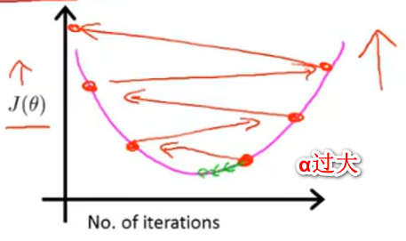
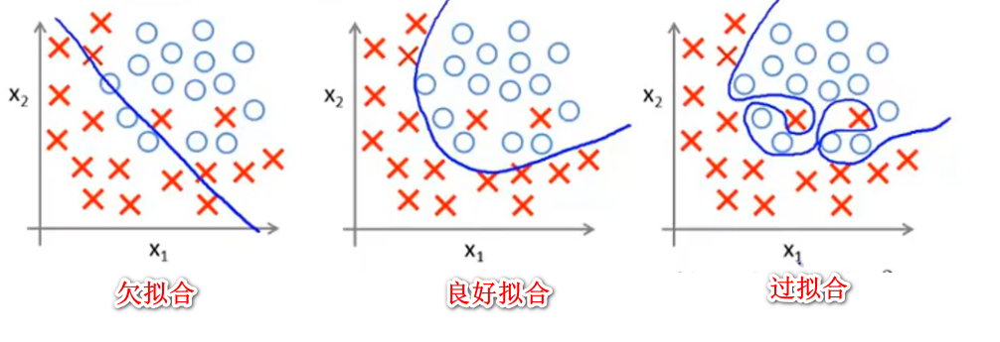

# 线性回归(liner regression)

1. 线性回归代价函数(cost function)：$J(\theta)=\frac{1}{2m}\sum_{i=1}^{m}(h_{\theta}(x^i)-y^i)^2$
    >- $h_{\theta}(x^i)=\theta^Tx=\theta_0+\theta_1x_1...$为线性拟合函数
    >- $y^i$ 实际值

2. 梯度下降（Gradient Decent）:$\theta_j=\theta_j-\alpha\frac{\partial}{\partial\theta_j}J(\theta)$
    $\theta_j=\theta_j-\alpha\frac{1}{m}\sum^{m}_{i=1}(h_{\theta}(x^i)-y^i)x_j^i$
    >- $\alpha$为学习率，$\alpha$过大会导致不收敛，甚至导致$\theta$越来越大，$\alpha$过小则收敛速度太慢。
    >- 梯度下降是为了得到使代价函数$J(\theta)$最小的的$\theta$
    >- 对于梯度下降，越接近极值点/局部极值点，其偏导就会越小，收敛速度就会越慢，所以一般不需要将$\alpha$调小。
    >- 对于梯度下降的x，若是不同x之间的取值范围差距过大，那么就需要采用特征缩放将这些值的取值范围限定到差不多相同的区间里面，通常的方法有，平均值标准化以及归一化。平均值标准化（Mean Normalization）: $x\leftarrow\frac{x-\mu}{s}$, $\mu$为x的平均值，s为x的最大值减去最小值

    

3. 正规方程法（Regular Equation）:$\theta=\left(X^TX\right)^{-1}X^Ty$
    >区别于梯度下降的迭代法，正规方程法可以使用数学解法求解得到最优$\theta$值，当n较小时比迭代要快很多，n为特征数量。

4. 梯度下降和正规方程法比较
    >|梯度下降|正规方程|
    >|:--:|:--:|
    >|需要选择合适的$\alpha$并且进行大量迭代|不需要选择$\alpha$也不需要进行迭代|
    >|即使当n非常大的时候也有不错的性能|需要计算$(X^TX)^{-1}$(时间复杂度$O(n^3)$)，当n比较大(>10000)时计算困难|
    >|在其他模型中也有很好的表现|基本只能用于线性回归模型|

5. 向量化(vectorization):$h(\theta)=\sum^{n}_{j=1}\theta_jx_j=\theta^Tx$
    > $\theta=[\theta_1,\theta_2,\dots,\theta_n]^T$
    > $x=[x_1,x_2,\dots,x_n]^T$

# Logistic regression

1. 分类(Classification)
    - classification：要预测的$y\in\{0,1\}$是一个离散值，但$h_\theta(x)$可以是大于1或者小于0的数
    - Logistic regression：$0<h_\theta<1$

2. logistic regression
    - 对于线性函数，代价函数为：$J(\theta)=\frac{1}{2m}\sum_{i=1}^{m}(h_{\theta}(x^i)-y^i)^2$
        >$h_{\theta}(x)=\frac{1}{1+e^{-\theta^Tx}}$
    - 令$Cost(h_{\theta}(x),y)=\frac{1}{2}(h_{\theta}(x)-y)^2$ 得到非线性函数代价函数: $J(\theta)=\sum^{m}_{i=1}Cost(h_{\theta}(x^i),y^i)$，替换Cost以使代价函数成为一个凸函数
        >其中$Cost(h_{\theta}(x^i),y^i)=\left\{\begin{array}{ll}-\log(h_{\theta}x)&if y=1\\-\log(1-h_{\theta}x) &if y=0\end{array}\right.$

        注意：y={0,1}，所以，$Cost(h_{\theta}(x^i),y^i)=1-[y^i\log(h_{\theta}x^i)+(1-y^i)\log(1-h_{\theta}x^i)]$
    - 其他优化算法
        > 除了梯度下降，还有共轭梯度下降(conjugate gradient)，BFGS，L-BFGS
        >- 优点：不需要手动选择$\alpha$,收敛速度快
        >- 缺点：更加复杂

# 正则化（Regularization）

1. 过拟合
    泛化能力差，不能良好的预测新样本
    
    解决办法：
    1. 减少特征数量
        - 手动选择保留特征
        - 使用模型选择算法
    2. 正则化
        - 保留所有的特征，但是减少量级或者$\theta_j$的值
        - 当特征值多的时候实际效果不错，因为每一个特征都对预测y有一些贡献
2. 正则化
    添加惩罚项，使参数$\theta$的值变小，从而不容易产生过拟合。
    >代价函数变为：$\min\limits_{\theta} J(\theta)=\frac{1}{2m}[\sum_{i=1}^{m}(h_{\theta}(x^i)-y^i)^2+\lambda\sum^{m}_{i=1}\theta^{2}_{j}$

    对于梯度下降：
    >$\begin{aligned}
        \theta_j&=\theta_j-\alpha\frac{1}{m}\sum^{m}_{i=1}(h_{\theta}(x^i)-y^i)x_j^i+\frac{\lambda}{m}\theta_j \\
        &=\theta_j(1-\alpha\frac{\lambda}{m})-\alpha\frac{1}{m}\sum^{m}_{i=1}(h_{\theta}(x^i)-y^i)x_j^i
    >\end{aligned}$

    对于正规方程
    >如果$\lambda>0$，$\theta =(X^TX+\lambda E)^{-1}X^Ty$
    >E为$(n+1)\times(n+1)$单位阵
    