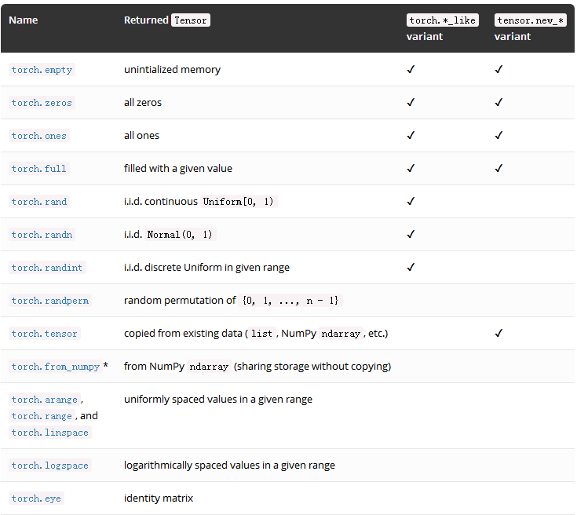

# 函数

- gather：沿指定轴(dim)的方向收集值，语法如下：
    ```python
    torch.gather(input, dim, index, out=None) # Tensor
    ```
    例子：
    ```python
    a = torch.Tensor([[1,2,3],[4,5,6]])
    print(a)
    idx1 = torch.LongTensor([[0,1],[2,0]])
    idx2 = torch.LongTensor([0,1,1],[0,0,0])
    print(torch.gather(a,dim=1,index=idx1))
    print(torch.gather(a,dim=0,index=idx2))
    ```
    结果如下：
    ```text
    1 2 3
    4 5 6
    [torch.FloatTensor of size 2x3]

    1 2
    6 4
    [torch.FloatTensor of size 2x2]

    1 5 6
    1 2 3
    [torch.FloatTensor of size 2x3]
    ```
- topk：沿给定dim维度返回输入张量input中 k 个最大值。 如果不指定dim，则默认为input的最后一维。 如果为largest为 False ，则返回最小的 k 个值。语法如下：
    ```python
    torch.topk(input, k, dim=None, largest=True, sorted=True, out=None) # -> (Tensor, LongTensor)
    ```
    例子：
    ```python
    a = torch.arange(1, 6)
    print(a)
    b = torch.topk(a, 3)
    print(b)
    c = torch.topk(a, 3, 0, largest=False)
    print(c)
    ```
    返回的结果为一个元组(values,indices), values为返回的前k个值，indices为这些值的索引：
    ```text
    tensor([1, 2, 3, 4, 5])
    (tensor([5, 4, 3]), tensor([4, 3, 2]))
    (tensor([1, 2, 3]), tensor([0, 1, 2]))
    ```
- `torch.*_like(tensor,dtype)`接收输入Tensor, 并返回一个与输入Tensor属性（形状，数据类型-不指定的话）相同的Tensor
    ```python
    x = torch.randn(3,dtype=torch.float64)
    print(torch.zeros_like(x))
    # tensor([0.,0.,0.],dtype=torch.float64)
    print(torch.zeros_like(x,dtype=torch.int32))
    # tensor([0,0,0],dtype=torch.int32)
    ```
- `tensor.new_*(size,dtype)`可以创建与Tensor数据类型相同的Tensor，输出Tensor的形状是必需的
    ```python
    x = torch.randn(3,dtype=torch.float64)
    print(x.new_ones(2))
    # tensor([1.,1.],dtype=torch.float64)
    print(x.new_ones(4,dtype=torch.int32))
    # tensor([1,1,1,1],dtype=torch.int32)
    ```
    <div align="center">
    
    </div>
